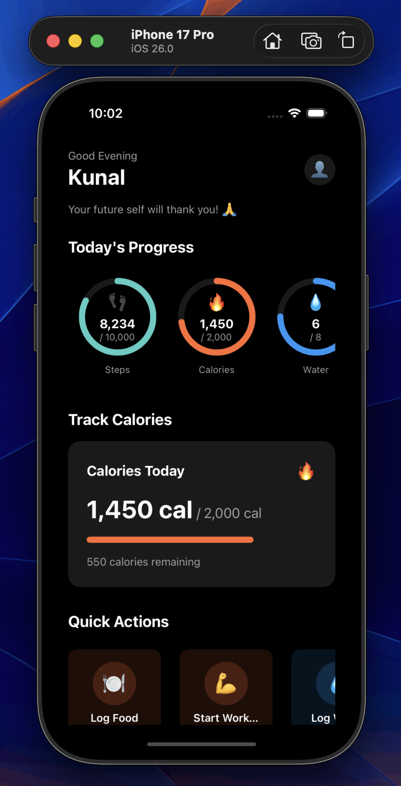

# FirstClub React Native

A React Native health dashboard application built with Clean Architecture and MVVM patterns.

## 📸 Screenshots




## 🚀 Quick Start

### Prerequisites
- Node.js >= 18
- npm or yarn
- iOS Simulator or Android Emulator

### Installation

```bash
# Install dependencies
npm install

# Start Expo development server
npm start

# Run on iOS Simulator
npm run ios

# Run on Android Emulator
npm run android

# Run on Web
npm run web
```

## 📁 Project Structure

```
src/
├── domain/               # Domain Layer (Business Logic)
│   ├── entities/        # Business entities
│   ├── interfaces/      # Domain enums & contracts
│   ├── repositories/    # Repository interfaces
│   └── usecases/        # Use Cases/Interactors
│
├── data/                # Data Layer (Implementation)
│   ├── repositories/    # Repository implementations
│   ├── sources/         # Local data sources
│   └── network/         # Network layer & API services
│
├── presentation/        # Presentation Layer (UI)
│   ├── screens/         # Screen components
│   ├── components/      # Reusable UI components
│   ├── interfaces/      # Presentation models
│   └── mappers/         # Domain → Presentation mappers
│
├── core/                # Core infrastructure
│   └── di/              # Dependency injection
│
├── types/               # Type definitions
└── utils/               # Utility functions
```

## 🏗️ Architecture

Built with **Clean Architecture** and **MVVM** pattern:
- **Domain Layer**: Core business logic, independent of frameworks
- **Data Layer**: Repository implementations and data sources
- **Presentation Layer**: UI components and ViewModels

## ✨ Features

- Today's health metrics with circular progress indicators
- Calories summary with progress tracking
- Quick action buttons
- Additional expandable metrics
- Smart health suggestions
- Recent activity feed

## 🛠️ Tech Stack

- React Native 0.73.2
- Expo ~50.0.0
- TypeScript 5.2.2
- React Native Reanimated
- React Native SVG
- AsyncStorage
- Inversify (Dependency Injection)
